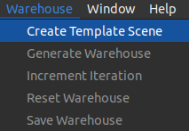
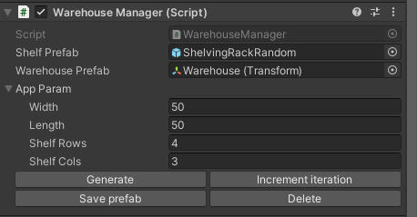

# Usage Documentation

**Table of Contents**
- [Usage](#usage)
- [Unity Package](#unity-package)
  - [Installation](#installation)
- [Provided Project](#provided-project)
    - [Download](#download)
- [Generating a Warehouse](#generating-a-warehouse)
- [Scenario](#scenario)

---

## Usage

There are two methods to using the Robotics Warehouse environment. Steps for both methods are detailed below.

If you have an **existing Unity project** in which you would like to generate the warehouse environment, or if you would like to **create a new project** for the warehouse, follow the steps detailed in the [Unity Package](#unity-package) steps.

If you would like to use the base **provided Unity project**, follow the steps detailed in the [Provided Project](#provided-project) steps.

---

## Unity Package

### Installation

1. In your Unity project (version 2021.1 or later), open the package manager from `Window` -> `Package Manager` and select "Add package from git URL..."

    

2. Enter the following URL to add the Warehouse base package:

    ```
    https://github.com/Unity-Technologies/Robotics-Warehouse.git?path=/com.unity.robotics.warehouse.base#dev
    ```

    > This base package contains shared scripts and resources between the URP and HDRP versions of the Warehouse.

3. Click `Add`.

4. Once it has finished importing and compiling, repeat this process with the appropriate URL to add the Warehouse package corresponding to your project's render pipeline:

    > Ensure your Unity project was created using the same render pipeline template as the package you're about to add!

    > If you're not sure, read more about the [Universal Render Pipeline](https://docs.unity3d.com/Packages/com.unity.render-pipelines.universal@13.1/manual/index.html) (URP) and the [High Definition Render Pipeline](https://docs.unity3d.com/Packages/com.unity.render-pipelines.high-definition@13.1/manual/index.html) (HDRP).

   - Universal Render Pipeline (URP):
        ```
        https://github.com/Unity-Technologies/Robotics-Warehouse.git?path=/com.unity.robotics.warehouse.urp#dev
        ```
   - High Definition Render Pipeline (HDRP):
        ```
        https://github.com/Unity-Technologies/Robotics-Warehouse.git?path=/com.unity.robotics.warehouse.hdrp#dev
        ```

5. Once both packages have finished importing and compiling, you can proceed to [Generating a Warehouse](#generating-a-warehouse).

---

## Provided Project

### Download

1. Clone this repository to your machine:

    ```bash
    git clone -b dev https://github.com/Unity-Technologies/Robotics-Warehouse.git
    ```

2. If you don't already have it, install and open the [Unity Hub](https://unity.com/download).

3. If you do not already have Unity **2021.1+**, go to the "Installs" tab in the Unity Hub, and click the "Install Editor" button.

    Select the desired Unity version **2021.1+**.

    > If the needed version is no longer available through the Hub, you can find it in the [Unity Download Archive](https://unity3d.com/get-unity/download/archive).

4. Go to the "Projects" tab in the Unity Hub and click the "Open" button.

   Navigate to and select the project corresponding to the desired render pipeline, located within this cloned repository to add this project to your Hub:

    > If you're not sure, read more about the [Universal Render Pipeline](https://docs.unity3d.com/Packages/com.unity.render-pipelines.universal@13.1/manual/index.html) (URP) and the [High Definition Render Pipeline](https://docs.unity3d.com/Packages/com.unity.render-pipelines.high-definition@13.1/manual/index.html) (HDRP).

   - Universal Render Pipeline (URP): `WarehouseProjectURP`

   - High Definition Render Pipeline (HDRP): `WarehouseProjectHDRP`

5. Once the project has opened in the Unity Editor, you can proceed to [Generating a Warehouse](#generating-a-warehouse).

---

## Generating a Warehouse

1. Once the Unity Editor is open, in the top menu bar, navigate to `Warehouse > Create Template Scene`.

    

    This will create and open an editable Warehouse template scene, located at `Assets/Scenes/Warehouse.unity`.

2. In the Hierarchy window, find and select the `WarehouseManager` GameObject if it is not already selected.

3. In the WarehouseManager's Inspector window, find the `Warehouse Manager (Script)` component.

   Expand down the `App Param` field if it is collapsed.

    

4. Modify the `App Param` values as desired for the width and length of the warehouse, as well as how many shelf rows and columns to generate.

    > The units listed are in meters; i.e. the default width and length of the generated warehouse is `50m x 50m`.

    > The shelves are by equally spaced throughout the warehouse based on the number of rows and columns.

5. Click `Generate` to generate a warehouse environment with the specified parameters!

6. By default, the shelves have a bit of randomized rotation to them, and the shelves are about half full of boxes. You can modify the Randomizer values by modifying the Randomizer properties in the `Scenario Shim (Script)` component on the WarehouseManager GameObject.

    > Learn more about the randomizers in the [Scenario](#scenario) section below.

7. You can now use the warehouse environment for your simulation needs!

    If desired, you can click `Save prefab` to save this version of the warehouse to `Assets/Prefabs/`, fine-tune the dimensions of the warehouse, or continue to increment iterations for new randomizations.

---

## Scenario

- The **Scenario Shim** on the `WarehouseManager` defines the core logic for randomization. You can modify the values in the listed Randomizers for the desired randomization behavior:
    - **FloorBoxRandomizerShim** - Spawns boxes on the floor of the warehouse. Use `Num Box To Spawn` to define how many boxes are spawned.
    - **LocalRotationRandomizerShim** - Assigns local rotation, used only on the shelves. It is suggested to keep the `X` and `Z` values at 0.
    - **SunAngleRandomizer** - Assigns the Directional Light angle and location. Note that this randomizer only runs during Play mode.
    - **ShelfBoxRandomizerShim** - Randomizes the number of boxes on the shelves. Use `Box Spawn Chance` to define the percent chance of a box spawning at each possible location.

- This can be re-run by incrementing the scenario iteration. This can be done via the `Increment Iteration` button in the `WarehouseManager`'s Inspector window.

> Learn more about the Perception Package [Randomization](https://github.com/Unity-Technologies/com.unity.perception/blob/master/com.unity.perception/Documentation~/Randomization/Index.md).
