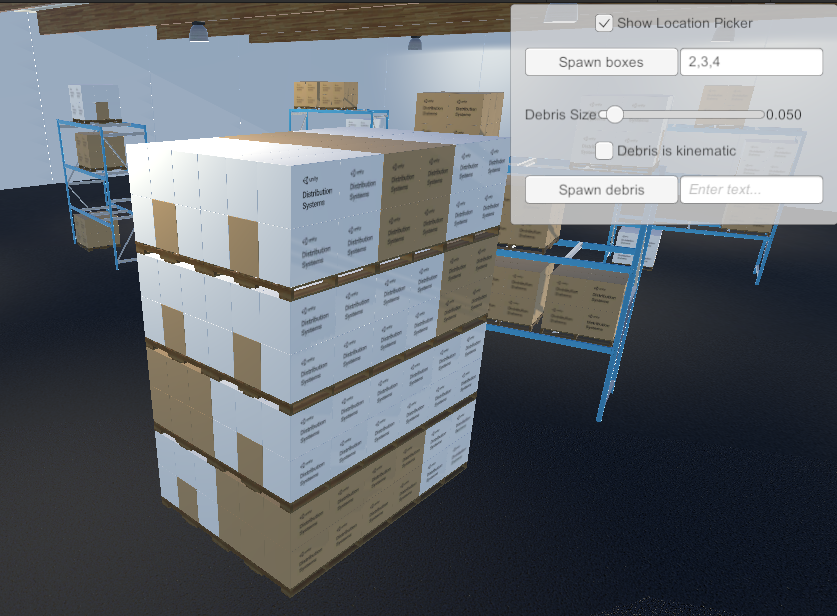

# Robotics Warehouse

<!--  -->

## Introduction

This repository contains a configurable warehouse environment that is ready for use in robotics simulation. The project comes in two formats: a standalone [Unity project](WarehouseProject/), and as a [Unity package](com.unity.robotics.warehouse/package.json).

You can see the warehouse in action in our [Navigation 2 SLAM Example](https://github.com/Unity-Technologies/Robotics-Nav2-SLAM-Example)!

> This repository has been adapted from the [Unity Simulation Sample Project: Warehouse Robot](https://assetstore.unity.com/packages/essentials/tutorial-projects/unity-simulation-sample-project-warehouse-robot-176606).

## Getting Started
To use the warehouse in your own project, check out the [Usage](Documentation/Usage.md) documentation.

## Additional Resources
- [Navigation 2 SLAM Example](https://github.com/Unity-Technologies/Robotics-Nav2-SLAM-Example)
- [Computer Vision Perception Package](https://github.com/Unity-Technologies/com.unity.perception/)

## Support
For questions or discussions about Unity Robotics package installations or how to best set up and integrate your robotics projects, please create a new thread on the [Unity Robotics forum](https://forum.unity.com/forums/robotics.623/) and make sure to include as much detail as possible.

For feature requests, bugs, or other issues, please file a [GitHub issue](https://github.com/Unity-Technologies/Robotics-Object-Pose-Estimation/issues) using the provided templates and the Robotics team will investigate as soon as possible.

For any other questions or feedback, connect directly with the
Robotics team at [unity-robotics@unity3d.com](mailto:unity-robotics@unity3d.com).

## More from Unity Robotics
Visit the [Robotics Hub](https://github.com/Unity-Technologies/Unity-Robotics-Hub) for more tutorials, tools, and information on robotics simulation in Unity!

## License
[Apache License 2.0](LICENSE)
