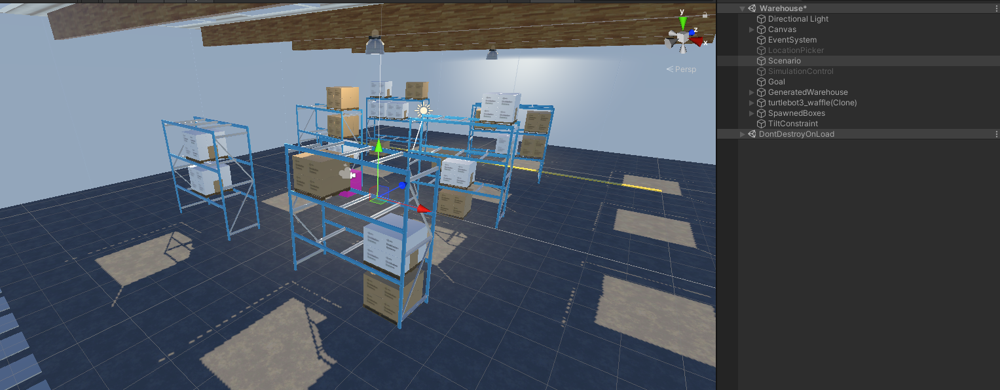
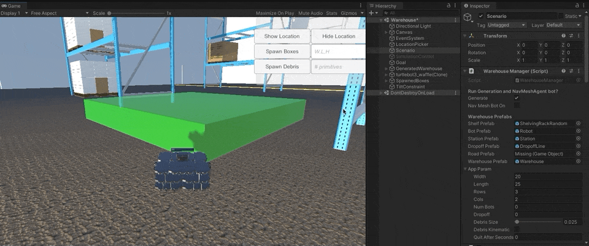
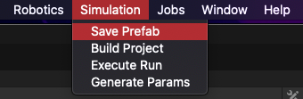

# Robotics-Warehouse

## Using the Warehouse 

**Unity version:** 2020.3.0f1

1. Open the project and open the Assets/Scenes/Warehouse scene.

    > Assets/Scenes/DeprecatedWarehouse contains the version (more or less) found on the [branch used during the AMR spike in December](https://github.com/Unity-Technologies/Robotics-AMR-Spike/tree/amanda/warehouse).

1. The **Scenario** GameObject defines the core logic for instantiation and randomization. Assign the values as desired (usage defined below):
   - Use the **Warehouse Manager** component to define dimensions of the warehouse (`width`, `length`) and shelf instantiation (`rows`, `columns`). The `Num Bots`, `Dropoff`, `Debris Size`, `Debris Kinematic`, and `Quit After Seconds` can be ignored during instantiation.
   - Use the **Perception Randomize Scenario** component to define the behavior of the randomized aspects of the environment.
     - **SunAngleRandomizer** - Directional Light angle and location
     - **TestLocalRotationRandomizer** - Assigns local rather than global rotation, most notably on the shelves. For the life of me, I cannot rename this to not have the Test prefix. 
     - **TestRobotPlacementRandomizer** - Instantiates Turtlebot on some random location on one of the Floor Objects (assigned on instantiation). `Dist From Edge` defines how far from the bounds of the selected Floor Object Turtlebot will spawn at (a safety check for floors that might exceed the length of the wall).
     - **MaterialRandomizer** - Assigns a material and physic material friction value to the floor.
     - **ShelfBoxRandomizer** - Randomizes the boxes on the shelves. Use `Box Spawn Chance` to define the % chance of a box spawning at each possible location.
     - **FloorBoxRandomizer** - Spawns random boxes on the floor of the warehouse with an attempt at making sure it doesn't spawn inside a shelf or on Turtlebot. Use `Num Object To Spawn` to define how many boxes are spawned on the ground.

    > The `Assets/Resources/param_1.json` file defines the parameter values for the Randomizers on the Perception Randomize Scenario script, which are assigned during runtime. They can still be changed during runtime, and the updated values will used in the next iteration.

1. For environment instantiation, leave the **SimulationControl** GameObject unchecked. Press play! Hopefully, there will be a **GeneratedWarehouse**, **turtlebot3_waffle(Clone)**, **SpawnedBoxes**, and **TiltConstraint** set up in the scene. 
   - The camera is attached to the spawned Turtlebot--if this isn't desired, feel free to remove the camera from the turtlebot prefab and add one to the scene.
   - Turtlebot can be moved using WASD.
   - The **Goal** GameObject randomizes the same way the floor boxes do.
   - Turtlebot's collisions in the scene will print to the Console.

1. Note the top-right HUD, with the `Show Location` button. This can be used to spawn a set of boxes or random primitives in specified locations, designated by the LocationPicker (the green box that appears when you click Show Location).

    

    

   - The debris spawned can be spawned using a set scale size in the Inspector (Scenario/WarehouseManager > Debris Size) and whether or not it is kinematic (Scenario/WarehouseManager > Debris Kinematic) 

    

1. Pressing **Space** will run a new Scenario Iteration, re-running the randomizers but not respawning the warehouse shell.

1. A sketchy script exists to save a generated warehouse shell (without the generated floor boxes, debris, or bot). During Play mode, this can be found in the top-level menu option `Simulation > Save Prefab`. This will save the warehouse to Assets/Prefabs/GeneratedWarehouse.

    
