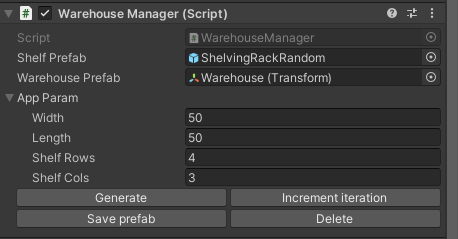

# Robotics-Warehouse

- [Robotics-Warehouse](#robotics-warehouse)
  - [Using the Warehouse](#using-the-warehouse)
    - [Editor Mode](#editor-mode)
    - [Play Mode](#play-mode)
  - [Scenario](#scenario)
  - [Rigidbody Spawning](#rigidbody-spawning)
## Using the Warehouse 

**Unity version:** 2020.3.0f1

1. Open the project and open the Assets/Scenes/Warehouse scene.
2. From here, there are two main uses of the generation: [Editor Mode](#editor-mode), or [Play Mode](#play-mode).

### Editor Mode
1. The scene should contain a Main Camera, Directional Light, and Simulation Control GameObject in the Hierarchy. The Simulation Control object can instantiate the WarehouseManager. Select the `Simulation Control` object, and click `Instantiate`.
    
2. A `Warehouse` GameObject should appear in the Hierarchy. Select it--there should be a `WarehouseManager` and `Perception Randomization Scenario` component on it. 
   
   1. Expand the `App Param` member on the `WarehouseManager` component. This defines the length and width of the warehouse, and how many rows and columns of shelves are instantiated. Set these values as you want the warehouse to look.
   2. Click the `Generate` button on the WarehouseManager to generate the warehouse with the specified parameters.
   3. Click `Save prefab` to save this version of the warehouse to `Assets/Prefabs`. Note: the spawned boxes and debris will not appear in this saved prefab.
   4. Use this spawned prefab in a new scene, or however you'd like!

### Play Mode

1. The scene should contain a Main Camera, Directional Light, and Simulation Control GameObject in the Hierarchy. Enter Play mode. The Simulation Control object will instantiate the WarehouseManager on runtime. 
    
1. A `Warehouse` GameObject should appear in the Hierarchy. Select it--there should be a `WarehouseManager` and `Perception Randomization Scenario` component on it. 
   
   2. Expand the `App Param` member on the `WarehouseManager` component. This defines the length and width of the warehouse, and how many rows and columns of shelves are instantiated. Set these values as you want the warehouse to look.
   3. Click the `Generate` button on the WarehouseManager to generate the warehouse with the specified parameters.
   4. Click `Save prefab` to save this version of the warehouse to `Assets/Prefabs`. Note: the spawned boxes and debris will not appear in this saved prefab.
   5. Use this spawned prefab in a new scene, or however you'd like!

## Scenario

- The **Perception Randomization Scenario** defines the core logic for randomization. Assign the values as desired (usage defined below):
  - **SunAngleRandomizer** - Directional Light angle and location
  - **LocalRotationRandomizer** - Assigns local rather than global rotation, most notably on the shelves. As a sanity check, this should probably keep the X and Z fields zeroed out, or the shelves will rotate in all DOF.
  - **MaterialRandomizer** - Assigns a material and physic material friction value to the floor.
  - **ShelfBoxRandomizer** - Randomizes the boxes on the shelves. Use `Box Spawn Chance` to define the % chance of a box spawning at each possible location.
  - **FloorBoxRandomizer** - Spawns random boxes on the floor of the warehouse with an attempt at making sure it doesn't spawn inside a shelf. Use `Num Box To Spawn` to define how many boxes are spawned on the ground.
- This can be re-run by incrementing the scenario iteration. This can be done via the `Warehouse` GameObject's `WarehouseManager` component, which shows an `Increment Iteration` button in the Inspector.

## Rigidbody Spawning

This feature is only implemented in Play mode.

- A UI overlay will appear in the top-right corner of the Game view. This can be used to spawn box towers or piles of debris with specified parameters.
  - **Show Location Picker**: This toggle simply turns on and off a green box that displays where the objects will approximately spawn.
  - **Spawn boxes**: The text field to the right of this button expects an input with the format `width,length,height`, e.g. `2,3,4`. Pressing the `Spawn boxes` button after this will create a tower of boxes with the given dimensions on the Location Picker location.
    
  - **Debris Size**: This slider defines the size of the debris spawned, and can be changed even after the objects have already been added to the scene. The number corresponds to the object max scaling.
  - **Debris is kinematic**: This toggle defines if the debris spawned is kinematic or not.
  - **Spawn debris**: The text field to the right of this button expects an integer input that describes the number of objects to spawn. Pressing the `Spawn debris` button will instantiate that number of random primitives of randomized scale, with respect to the `Debris Size`.
    